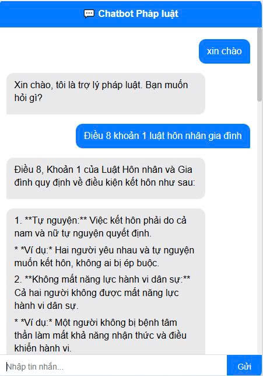
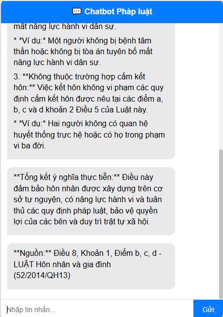
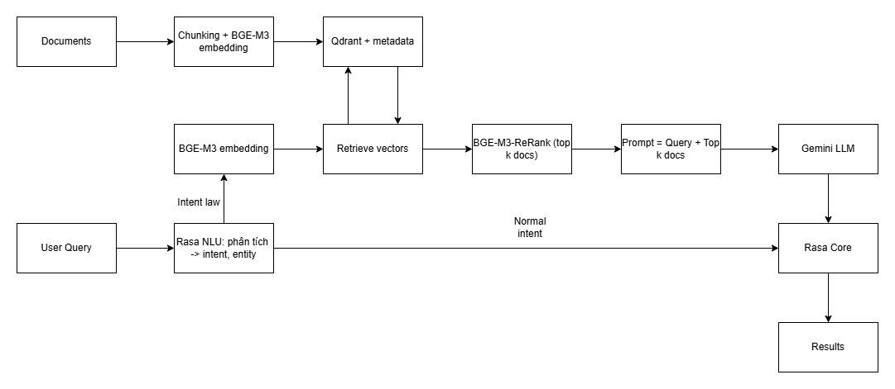

# LEGAL ADVISORY CHATBOT (Rasa + RAG Pipeline + Gemini)

Dự án Chatbot Tư vấn Pháp luật Việt Nam sử dụng kiến trúc
**Retrieval-Augmented Generation (RAG)** kết hợp với **Rasa Framework**.
Hệ thống có khả năng tra cứu văn bản luật chính xác nhờ cơ chế Semantic
Search (BGE-M3) và Re-ranking, sau đó tổng hợp câu trả lời tự nhiên bằng
**Gemini 2.0 Flash**.

------------------------------------------------------------------------

## Demo
- Dưới đây là hình ảnh thực tế giao diện và khả năng trả lời của Chatbot:

*Giao diện Chatbot trả lời câu hỏi về Luật Hôn nhân & Gia đình, có trích dẫn nguồn luật cụ thể.*
> **Mô tả luồng hoạt động trong ảnh:**
> 1. Người dùng đặt câu hỏi tự nhiên.
> 2. Hệ thống tìm kiếm các điều luật liên quan trong Database.
> 3. Bot tổng hợp thông tin và đưa ra tư vấn chính xác.
------------------------------------------------------------------------
## Nguồn dữ liệu (Data Sources)

Các văn bản luật được sử dụng trong dự án được thu thập từ **Văn Bản Pháp luật Việt Nam**:  

- Website chính thức: [https://vbpl.vn/](https:////vbpl.vn/)  
- Bao gồm các loại văn bản: **Luật, Nghị định, Thông tư, Quyết định, Văn bản hướng dẫn khác**  
- Dữ liệu được xử lý và lưu trữ trong SQLite + FAISS để phục vụ RAG Pipeline 
  > Trước đây dự án sử dụng **Qdrant**, nhưng do Qdrant đã hết lưu trữ miễn phí nên đã chuyển sang **FAISS** 

------------------------------------------------------------------------
## Tính năng nổi bật (Key Features)

### Rasa Core & NLU

Quản lý hội thoại và nhận diện ý định người dùng (Intents: hỏi luật,
chào hỏi, chitchat...).

### Advanced RAG Pipeline

-   **Retrieval:** Sử dụng *BAAI/bge-m3* đã fine tune để tạo embedding và tìm kiếm
    vector tốc độ cao với **FAISS**.
-   **Re-ranking:** Tích hợp *BAAI/bge-reranker-v2-m3* (Cross-Encoder)
    để sắp xếp lại kết quả tìm kiếm.
-   **Generative AI:** Tích hợp **Google Gemini 2.0 Flash** để tóm tắt,
    suy luận và trả lời tự nhiên.
-   **Database:** Lưu metadata + văn bản luật đầy đủ bằng SQLite.

### Giao diện Web

Chat widget HTML/CSS/JS kết nối qua REST API để giao tiếp giữa giao diện Web và Rasa Server.

------------------------------------------------------------------------

## Kiến trúc hệ thống (System Architecture)

------------------------------------------------------------------------

## Cấu trúc dự án

    LEGAL_ADVISORY_CHATBOT/
    ├── database/                # Chứa file FAISS index và SQLite DB
    ├── models/                  # Rasa models đã train và model BGE-M3 sau khi fine-tuned
    ├── src/
    │   ├── notebook/            # Fine-tune & Evaluate Model BGE
    │   ├── rag/                 # RAG Pipeline (query_rag.py)
    │   ├── rasa/                # Source code Rasa
    │   └── web/                 # Frontend HTML/CSS/JS
    ├── .env                     # Biến môi trường
    ├── requirements.txt         # Thư viện
    └── README.md

------------------------------------------------------------------------

## Kết quả đánh giá (Evaluation)
-   Mô hình được đánh giá trên dữ liệu test gồm 737 câu hỏi được thu thập từ các câu hỏi trên Thư Viện Pháp Luật.
-   Embedding Model: **BAAI/bge-m3 (Fine-tuned)**
-   Re-ranking cải thiện mạnh mẽ **MRR@5**
-   Notebook đánh giá tại: `src/notebook/BGE_M3_Evaluation.ipynb`
- **BGE-M3 (Fine-Tuned):** MRR@5 = 0.35, nDCG@5 = 0.26
- **BGE-M3 (Fine-Tuned) + ReRank:** MRR@5 = 0.39, nDCG@5 = 0.32
> MRR:
> Đo xem vị trí của câu trả lời đúng xuất hiện sớm đến mức nào trong danh sách kết quả.
> Nếu câu trả lời đúng nằm ở vị trí 1 thì điểm = 1, vị trí 2 thì 1/2, vị trí 5 thì 1/5.
> MRR cao nghĩa là hệ thống đặt câu trả lời đúng lên trên đầu tốt hơn.
> nDCG:
> Đo chất lượng xếp hạng toàn bộ danh sách, không chỉ đúng hoặc sai.
> Phạt nặng các câu trả lời đúng nhưng bị xếp quá sâu.
------------------------------------------------------------------------

## Liên hệ

- **Author:** Phan Quyết Tâm Phú
- **Email:** tamphu.workhard@gmail.com
- **LinkedIn:** https://www.linkedin.com/in/phu-phanquyettam/
